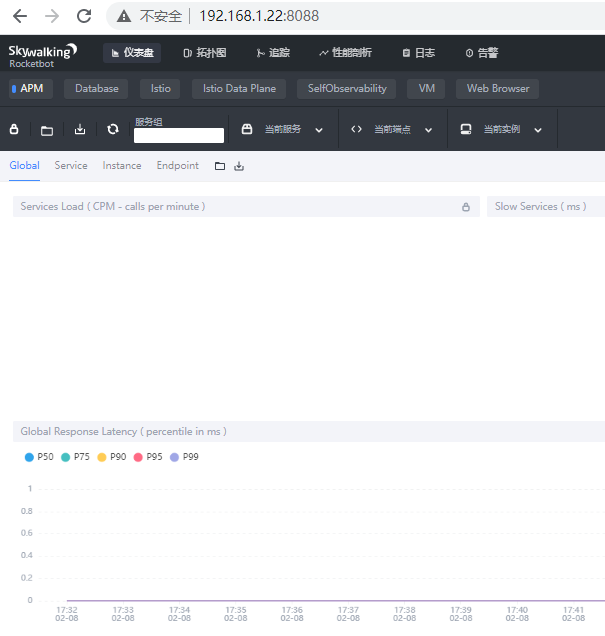
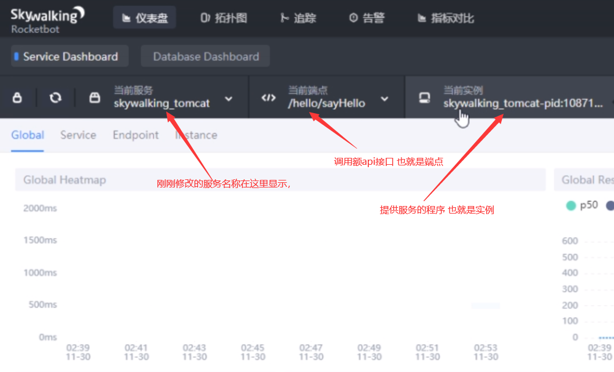
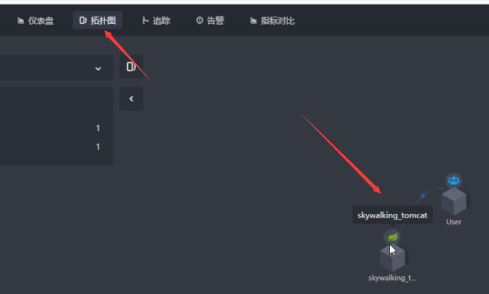
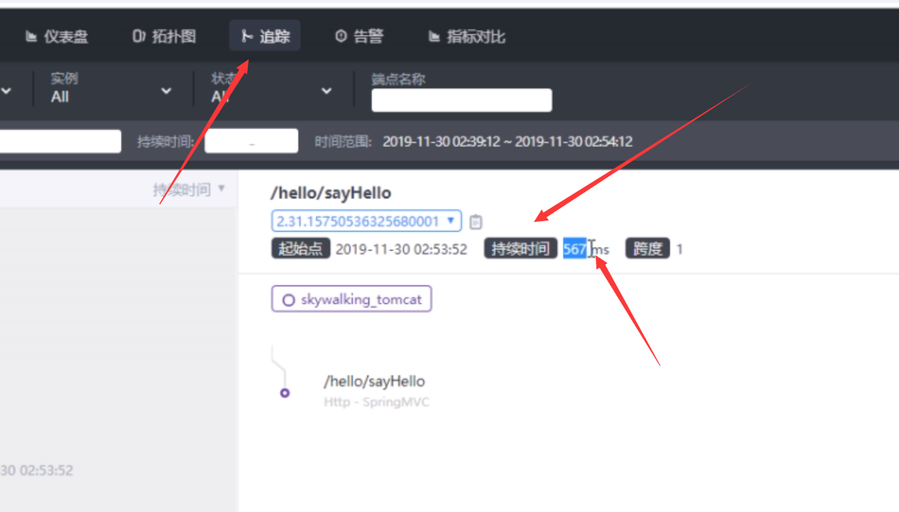
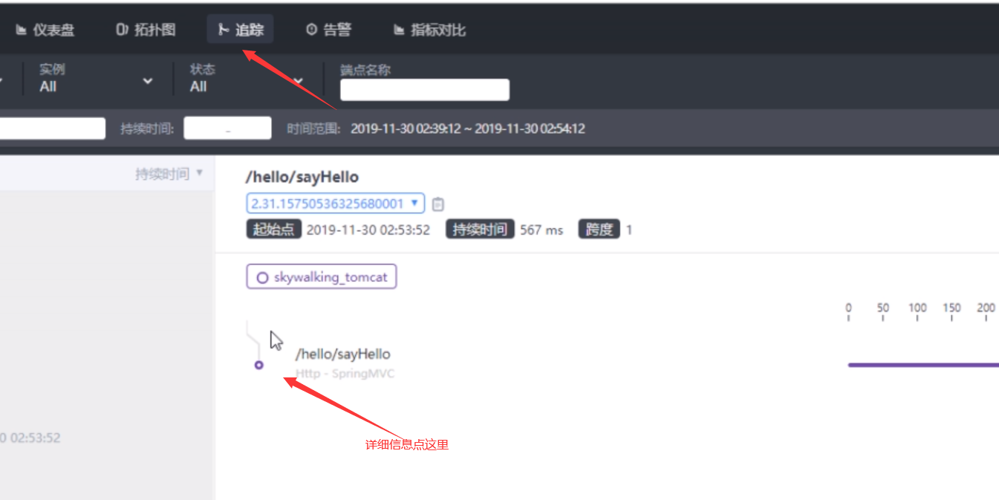

# skywalking概述

- 微服务的出现带来了很多便捷也带来了很多问题，如众多微服务中一个出现问题后 怎样快速定位，每个微服务都有一个单独的数据库，这也增加了定位问题的难度，链路追踪可以帮助我们一定程度的解决这个问题
- skywalking是一个可观测性分析平台（OAP）和性能管理系统（APM）
- 整体框架包含以下三个部分
  - 探针(agent） agent会被安装到服务所在的服务器或者容器中以实现数据的捕获
  - OAP 可观测平台， agent 采集的数据加工后被存储到数据库，支持数据库有 ES，mysql，h2等，而后提供HTTP查询接口。
  - skywalking的单独的UI界面 调用OAP接口 进行数据查询展示等。

- 支持语言有 java  .NET CORE 和nodejs 。相比其他平台 单一语言支持有着很大优势。

# 概念

- APM
  - 应用性能管理系统
  - 帮助理解系统行为，用于分析性能问题的工具，便于发生故障时快速定位问题。

- 分布式链路追踪
  - 微服务时代 往往一个用户的请求会经过多个微服务，一个微服务的故障可能会导致多个服务无法使用，如缓存服务可以导致认证服务 和消息服务，链路追踪可以一定程度上帮助定位问题

- OpenRracing
  - OpenRracing 是一个分布式链路追踪的规范，由google的一个论文中提出，提供平台无关，厂商无关的api。使得开发人员更方便添加，替换 追踪系统的实现。
  - skywalking就是使用了此规范

- skywalking中的概念
  - 服务  service
    - 集群中每个服务都是一个service
  - 端点  endpoint
    -  每个接口对skywalking来说都是一个端点，如/use/query/all 这个接口就是一个端点，此端点是可以由其他的service访问的
  - 实例  instance
    - 由于每个service需要高可用性 则需要部署多份 ，那每个service 就是一个实例

# 环境搭建

## 简单部署es7

生产中还是需要集群的  这里为了演示 采用单机简易部署

```sh
wget https://artifacts.elastic.co/downloads/elasticsearch/elasticsearch-7.4.1-x86_64.rpm
```

```sh
yum install -y elasticsearch-7.4.1-x86_64.rpm
```

```sh
#优化
vm.max_map_count=262144
sysctl -p

#追加内容到 /etc/security/limits.conf
elasticsearch soft nofile 65535
elasticsearch hard nofile 65535
elasticsearch soft nproc 4096
elasticsearch hard nproc 4096
```

```
#启动服务
systemctl start elasticsearch.service && systemctl enable elasticsearch.service 
```

## skywalking部署

- https://archive.apache.org/dist/skywalking/8.4.0/
- 需要JDK 自行安装 ，这里采用jdk11

```sh
wget https://archive.apache.org/dist/skywalking/8.4.0/apache-skywalking-apm-es7-8.4.0.tar.gz
```

```sh
tar xf apache-skywalking-apm-es7-8.4.0.tar.gz -C /usr/local/src 
ln -s /usr/local/src/apache-skywalking-apm-bin-es7 /usr/local/skywalking
```

```yaml
#修改配置/usr/local/skywalking/config/application.yml

#集群配置
cluster:
  #选择配置，这里使用单机版
  selector: ${SW_CLUSTER:standalone}
  #单机版配置
  standalone:
    ...
  #基于zk集群配置
  zookeeper:
    ...
...
#数据库
storage:
  #这里使用elasticsearch7 默认是h2
  selector: ${SW_STORAGE:elasticsearch7}
  ...
  ...
  elasticsearch7:
    nameSpace: ${SW_NAMESPACE:""}
    clusterNodes: ${SW_STORAGE_ES_CLUSTER_NODES:127.0.0.1:9200}
    ...
...
```

```yaml
#修改UI端口/usr/local/skywalking/webapp/webapp.yml

server:
  #访问端口号
  port: 8088
 
collector:
  path: /graphql
  ribbon:
    ReadTimeout: 10000
    # Point to all backend's restHost:restPort, split by ,
    # 内置zuul负载均衡
    listOfServers: 127.0.0.1:12800
```

```sh
#启动
cd /usr/local/skywalking/bin 
./startup.sh
SkyWalking OAP started successfully!
SkyWalking Web Application started successfully!
```



## Agent

- agent可以在不修改代码的情况下，对java应用上使用到组件进行动态监控，获取运行数据发送到OAP上进行统计和存储。
- agen支持JDK6-12的版本

```sh
##agent文件 位置
cd /usr/local/skywalking/agent 
```

```sh
#agent 目录结构
ll /usr/local/skywalking/agent |awk '{print $1 "   " $9}' 。
drwxrwxr-x   activations	
drwxrwxr-x   bootstrap-plugins
drwxrwxr-x   config			#存放配置文件		
drwxrwxr-x   logs			#日志目录
drwxrwxr-x   optional-plugins   #未启动的插件存放位置 需要启动 可以移动到 plugins 目录
drwxrwxr-x   optional-reporter-plugins
drwxrwxr-x   plugins  #启用的插件存放位置
-rw-rw-r--   skywalking-agent.jar  #代理程序
```

### Agent -Tomcat使用方法

- agent.service_name以及其他变量 都可以以java -Dskywalking.agent.service_name=***或者 java -javaagent:agent/skywalking-agent.jar=agent.service_name='skywalking_tomcat',[K]=[V]的方式覆盖配置
- 配置系统环境变量 也可以使其生效 如 skywalking.agent.service_name=***

```SH
#修改agent配置 /usr/local/skywalking/agent/config/agent.config
#Your_ApplicationName改为skywalking_tomcat(自己的应用名称)用于在ui界面显示
agent.service_name=${SW_AGENT_NAME:skywalking_tomcat}
#修改127.0.0.1为skywalking服务所在的ip或者可以解析的主机名
collector.backend_service=${SW_AGENT_COLLECTOR_BACKEND_SERVICES:127.0.0.1:11800}
```

```sh
#修改tomcat启动脚本catalina.sh 顶部添加
CATALINA_OPTS="$CATALINA_OPTS -javaagent:/usr/local/skywalking/agent/skywalking-agent.jar"; export CATALINA_OPTS
```

调用一次api然后 去ui界面查看









### Agent-springboot使用方法

```sh
#修改agent配置 /usr/local/skywalking/agent/config/agent.config
#Your_ApplicationName改为spingboot_eshop_admin(自己的应用名称)用于在ui界面显示
agent.service_name=${SW_AGENT_NAME:spingboot_eshop_admin}
#修改127.0.0.1为skywalking服务所在的ip或者可以解析的主机名
collector.backend_service=${SW_AGENT_COLLECTOR_BACKEND_SERVICES:127.0.0.1:11800}
```

```sh
java -javaagent:/usr/local/skywalking/agent/skywalking-agent.jar -Dserver.port=8056 \
-jar ...
```

